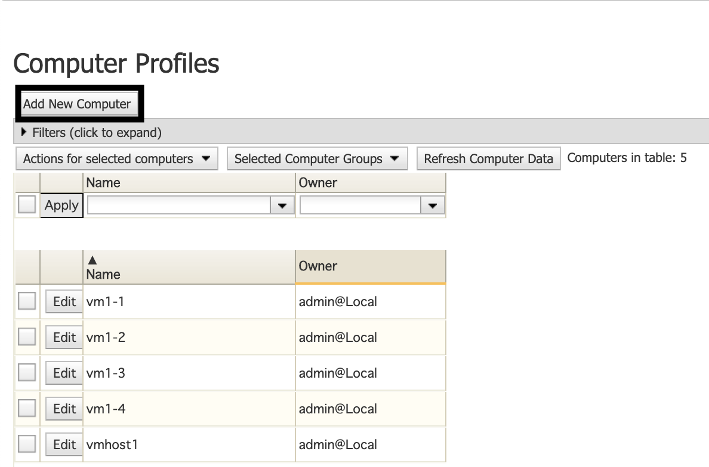

# Adding Computers

1. Click **Manage** and then navigate to **Manage Computers** and click it.     
   
   
2. Select _Edit Computer Profiles_ and click **Submit** 
   
   

3. Click **Add New Computer** 
   
   

4. On the next menu, input the following information :
   
   * _Single/Multiple_ computer(s)
   * **Name** of computer
   * Owner
   * **Type** of computer
   * Public & Private IP Address
   * Public & Private MAC Address
   * Provisioning Engine
   * State
   * Platform
   * Schedule
   * RAM (MB)
   * Core(s) 
   * Processor Speed (MHz)
   * Network
   * Predictive Loading Module
  
    

5. Configure the settings regarding if the computer is set to **connect with the usage of NAT**
6. Click **Add Computer**

