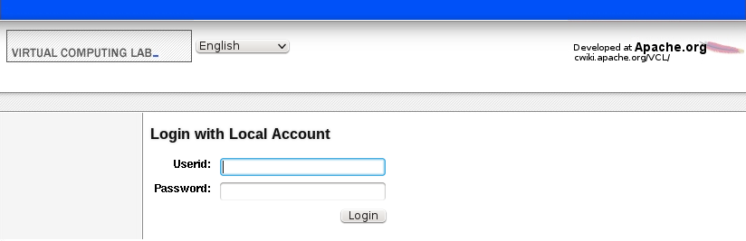

The conf.php file under the .ht-inc directory of the web code needs to be modified. There are two items to work with:

            define("NOAUTH_HOMENAV", 0);
            $NOAUTH_HOMENAV = array (
                "What is VCL" => "http://vcl.apache.org/",
                "How to use VCL" => "https://cwiki.apache.org/confluence/display/VCL/Using+VCL",
                "Report a Problem" => "mailto:" . HELPEMAIL,
            );

To enable the navigation links, define **NOAUTH_HOMENAV** to be 1.

To control what items show up in the navigation list, modify the **$NOAUTH_HOMENAV** array. Each key in the array is the text that will show up in the navigation list. Each value in the array is what that item will link to.

This is what the login page looks like with the navigation links **disabled**:

This is what the page looks like with the navigation links **enabled**:

