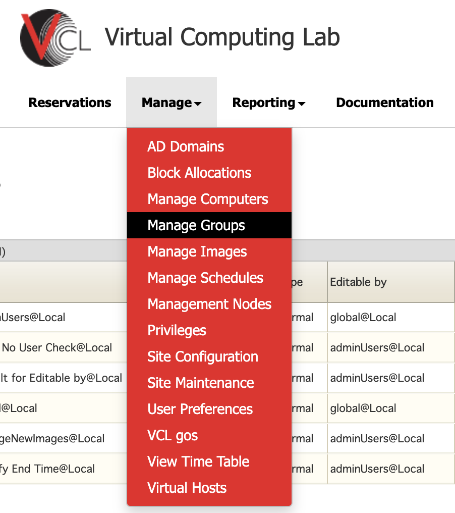
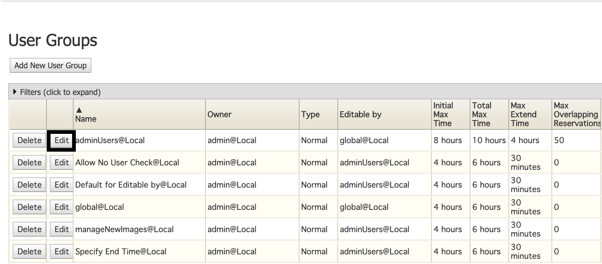
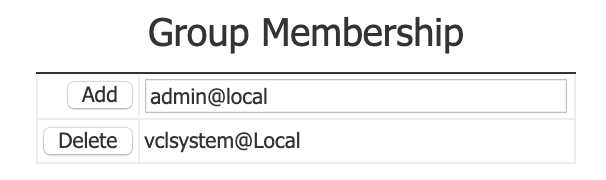

# Overview
Users are granted access to user groups through the VCL website under the _Manage_ menu.
This guide will discuss how to add users to a pre-existing user group.

# Adding Users to User Groups
With the appropriate administration permissions, you will see an option called **Manage Groups.**

1. Select the Manage Groups.

    

2. Under the User Groups section, select **edit** onto a pre-exisiting user group.

    

3. In the **Group Membership** dialogue.

    

4. Add a user by typing in the user ID with the appropriate affiliation.

    
5. Click Add to submit the user to the group.

  **NOTE**
If the affiliation is not specified, then the default affiliation will be
associated with one respective to the current user.

  
