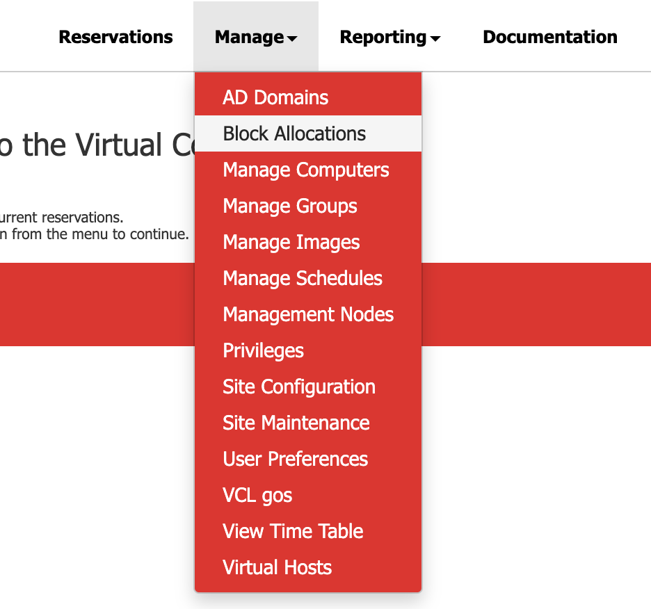

In order to create a new block allocation, follow these steps: 

* Navigate to **Manage->Block Allocations**

    
* Click on **Create New Block Allocation**

    
* Fill out the desired properties for the new Block Allocation and click **Submit New Block Allocation**

    

Refer to these pages for more information on **Block Allocation**:
* [Block Allocation](https://cwiki.apache.org/confluence/pages/createpage.action?spaceKey=VCLDOCS&title=What+is+a+Block+Allocation&linkCreation=true&fromPageId=68715524)
* [How Block Allocations Work](https://cwiki.apache.org/confluence/pages/createpage.action?useDraft=true&spaceKey=VCLDOCS&draftId=115529624&draftShareId=ecc63207-e1a1-4a1c-ba3e-ea731b4500bb&&)
* [Benefits of Block Allocations](https://cwiki.apache.org/confluence/pages/resumedraft.action?draftId=115529625&draftShareId=3f1838f9-5486-40c7-8fb7-f37d15c79387&)
* [Block Allocation Properties](https://cwiki.apache.org/confluence/pages/resumedraft.action?draftId=115529626&draftShareId=2d3d43f3-280c-4cc5-9449-379791e68c50&)
* [Editing an Existing Block Allocation](https://cwiki.apache.org/confluence/pages/resumedraft.action?draftId=115529628&draftShareId=5ed7e485-623e-488c-856c-22ca698af88d&)