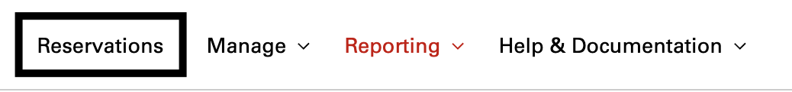
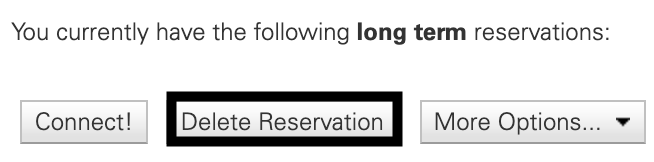

## Overview
VCL reservations will automatically time-out once the reservations has passed it's allotted time. If users finish work before the reservation is over and would like to end the reservation themselves they can. 
This guide will discuss the ways of deleting a reservation.

* Click **Reservations** from the left navigation menu:

    

* Click **Delete Reservation**

    
