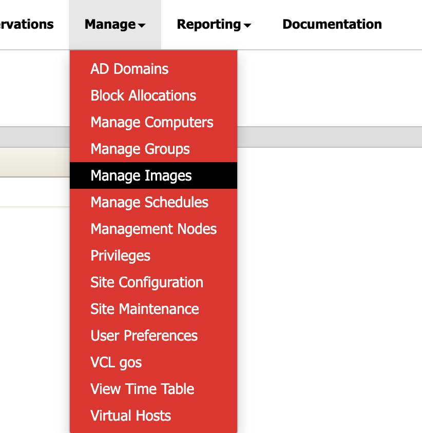
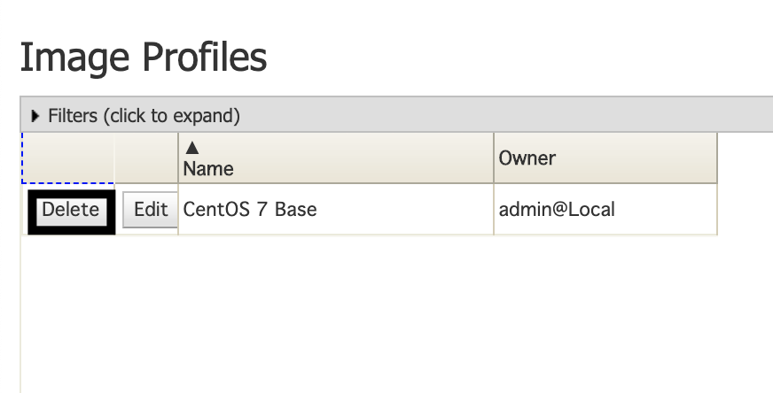

* Click **Manage** and navigate to **Manage Images** and click it.
  
    

* Select the **Delete** button on the image you wish to delete.

    

 **NOTE** 

*Deleting an image is only possible for the owners of the respective image.*