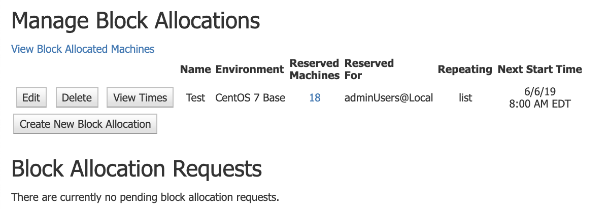

In order to edit an existing block allocation, follow these steps:

* Navigate to **Manage->Block Allocations**

    
* Click on **Edit** next to the preferred exisiting block allocation

    
*  Fill out the desired properties for the block allocation change and click **Submit Block Allocation Changes**

     

Refer to these pages for more information on **Block Allocation**:
* [Block Allocation](https://cwiki.apache.org/confluence/pages/createpage.action?spaceKey=VCLDOCS&title=What+is+a+Block+Allocation&linkCreation=true&fromPageId=68715524)
* [Benefits of Block Allocations](https://cwiki.apache.org/confluence/pages/resumedraft.action?draftId=115529625&draftShareId=3f1838f9-5486-40c7-8fb7-f37d15c79387&)
* [How Block Allocations Work](https://cwiki.apache.org/confluence/pages/createpage.action?useDraft=true&spaceKey=VCLDOCS&draftId=115529624&draftShareId=ecc63207-e1a1-4a1c-ba3e-ea731b4500bb&&)
* [Block Allocation Properties](https://cwiki.apache.org/confluence/pages/resumedraft.action?draftId=115529626&draftShareId=2d3d43f3-280c-4cc5-9449-379791e68c50&)
* [Creating a New Block Allocation](https://cwiki.apache.org/confluence/pages/resumedraft.action?draftId=115529627&draftShareId=2c306a21-87d6-494c-9322-57f3fb22b567&)

