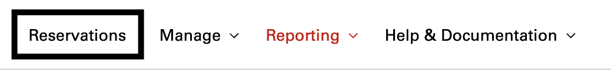

## Overview
Reservations are only up and running for the given time alloted when the reservation was created. A way to bypass this alotted time in order to extend it will be discussed in this guide.

* Click **Reservations** from the left navigation menu:

    

* Click **More Options...** and then click **Edit**

      

* Choose how much more time to extend the reservation by clicking on the **drop-down menu**

    

* Click **modify reservation**

    
