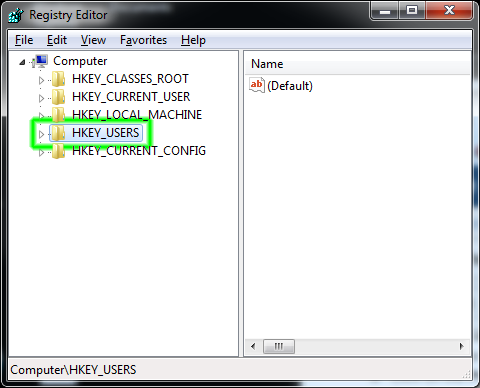
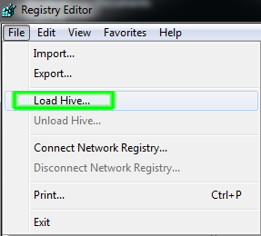
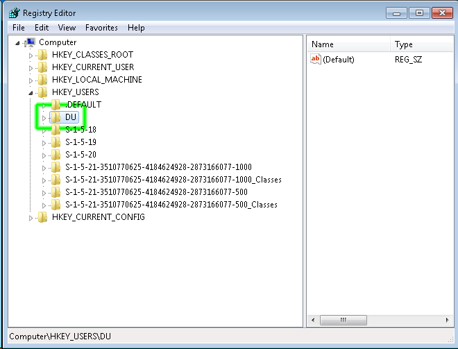
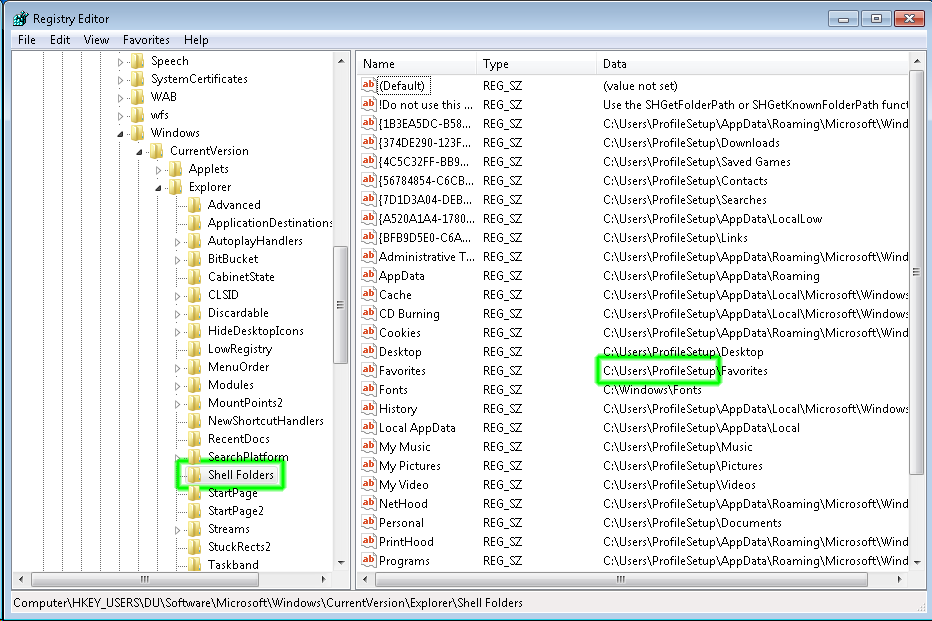
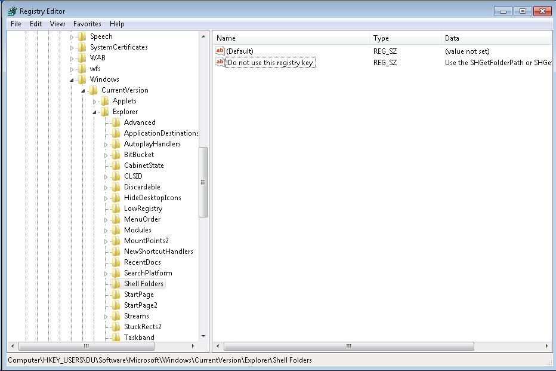
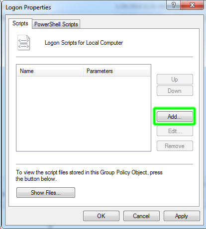

A Windows user profile defines the look and feel of the desktop environment configured for a particular user. It contains various settings such as desktop colors, backgrounds, icon placement, and Windows Explorer settings.

The default profile is a template profile that is used when a user logs on to a Windows computer for the first time. The default profile can be customized by the image creator.

* [Windows 7 and Windows Server 2008](#windows-7-and-windows-server-2008)
    * [Enable Desktop Background](#enable-desktop-background)
    * [Create a Profile Setup Account](#create-a-profile-setup-account)
    * [Configure the User Profile for the Profile Setup Account](#configure-the-user-profile-for-the-profile-setup-account)
    * [Copy the Customized Profile to Default](#copy-the-customized-profile-to-default)
    * [Clean the Registry for the Customized Profile](#clean-the-registry-for-the-customized-profile)
    * [Configure the User Account Picture (Optional)](#configure-the-user-account-picture-optional)
    * [Force the Desktop Background to Appear on Windows 7 & Windows Server 2008 (Optional)](#force-the-desktop-background-to-appear-on-windows-7--windows-server-2008-optional)
* [Windows XP and Windows Server 2003](#windows-xp-and-windows-server-2003)
    * [Create a Profile Configuration Account](#create-a-profile-configuration-account)
    * [Copy the Customized Profile to "Default User"](#copy-the-customized-profile-to-default-user)
    * [Clean up the Profile Configuration Account](#clean-up-the-profile-configuration-account)

## Windows 7 and Windows Server 2008

Microsoft does not support copying profiles under Windows 7 and Windows Server 2008. The "Copy To" button is grayed out for all profiles except the default profile.

The only supported method is built into Sysprep and this method is itself very problematic. The following steps are not supported or recommended by Microsoft but seem to work:

### Enable Desktop Background
1. Download and edit the RDP file for your imaging reservation from the VCL website to allow desktop backgrounds or else you won’t be able to change the desktop background color
    1. Right-click on the .rdp file and select Edit
    2. Click on the Experience tab
    3. Select LAN (10 Mbps or higher)
    4. Make sure the checkbox next to Desktop background is enabled

    

    5. Click on General Tab
    6. Click Save
2. Login to the VCL reservation as Administrator
3. Configure Windows Explorer to show hidden and system file
    1. Open Windows Explorer
    2. Click Organize > Folder and search options
    3. Select the View tab
    4. Select the radio button next to Show hidden files, folders, and drives
    5. Click OK

### Create A Profile Setup Account

1. Create a new local user account named ProfileSetup (*Note: the name does not matter but should be something that would not match another string in the stock Windows registry. You will be searching the registry for the name of the user you use to configure the profile. Using a unique name will make this easier.*)
    1. Open Control Panel > Add or remove user accounts
    2. If there is already an account named ProfileSetup and you want to start over with a new account, delete the existing account and then create a new one:
        1. Click on the ProfileSetup user
        2. Click Delete the account
        3. Click Delete Files
        4. Click Delete Account
    3. Click Create a new account
    4. Enter the account name: ProfileSetup
    5. Click the radio button next to Administrator
    6. Click Create Account
2. Set the password for the ProfileSetup account
    1. Click on the ProfileSetup account
    2. Click Create a password
    3. Enter the password and click Create password

### Configure the User Profile for the Profile Setup Account

1. Logout as Administrator and login as ProfileSetup

    If you intend to arrange the icons on the desktop, use a screen size of 1024x768 when logged in as ProfileSetup.  This is the default screen size that most users will use when they connect to VCL reservations.  If you arrange the icons using a custom screen size, the icons most users see will be rearranged when they connect using the default size.

2. Customize the user profile while logged in as ProfileSetup account (*configure the desktop background, arrange icons, etc*).  The following tips are optional:
    1. Download and run [Autoruns](https://docs.microsoft.com/en-us/sysinternals/downloads/autoruns).  This free utility will show you all of the things that run when the computer boots, a user logs in, etc. There are several things that can probably be disabled such as Windows Mail.

### Copy the Customized Profile to Default

1. Logout as ProfileSetup and login as Administrator
2. Rename the ProfileSetup user profile folder to Default:
    1. Open a Windows Explorer window and navigate to C:\Users
    2. Rename the original default profile folder: C:\Users\Default -> C:\Users\DefaultOriginal
    3. Rename the customized profile folder: C:\Users\ProfileSetup -> C:\Users\Default
    *Note: if you are unable to rename the ProfileSetup folder, reboot the computer, login as Administrator, and try again. Run the following command from a command prompt to reboot the computer:*

        shutdown.exe -r -f -t 0
3. Copy the customized profile folder using the Windows profile copying utility:
*Note: Windows 7 only allows its built-in profile copying utility to be used to copy the default profile, not profiles of other user accounts. The profile you customized now resides in the default profile location (C:\Users\Default) so the utility can now be used to make a copy of it.*
    1. Open Control Panel > System and Security > System
    2. Click Advanced system settings on the left
    3. Click the Settings... button under User Profiles
    4. Highlight Default Profile
    5. Click Copy To…
        1. Copy profile to: C:\Users\DefaultCopy
        2. Click Change under Permitted to use
        3. Enter Everyone and click OK
        4. Click OK
4. Replace the original customized profile directory with the one created by the Windows profile copying utility
*Note: C:\Users\Default contains the original customized profile. The same profile also resides in C:\Users\DefaultCopy. The DefaultCopy folder is the one which has had the Windows profile copying utility transformations applied to it.*
    1. Open Windows Explorer
    2. Delete the “C:\Users\Default folder
    3. Rename the folder: C:\UsersDefaultCopy -> C:\Users\Default
5. Delete the ProfileSetup account:
    1. Open Control Panel > Add or remove user accounts
    2. Click on the ProfileSetup account
    3. Click Delete the account
    4. Click Delete Files
    5. Click Delete Account

### Clean the Registry for the Customized Profile

1. While logged in as Administrator
2. Run regedit.exe
3. Select the HKEY_USERS hive:

    

4. Click the File menu and select Load Hive:

    

5. Browse to C:\Users\Default
6. Enter ntuser.dat in the File name: field (*Note: this file is hidden so it normally is not displayed in the list of files*)

    

7. Enter a Key Name: DU

    

8.  Navigate to:
    **HKEY_USERS\DU\Software\Microsoft\Windows\CurrentVersion\Explorer\Shell Folders**

    You will probably see the path to the ProfileSetup account's original user profile directory saved in many of the values as highlighted below.  This can cause problems with programs which use these values.  For example, a user may save a file to the Desktop from within a program, but the saved file doesn't appear on the user's desktop.

    

9. Delete all of the values under Shell Folders except for (Default) and **"!Do not use this registry key":**

    

10. Select the DU key in the left pane
11. Click on the Edit menu and select Find...
12. Search the DU key for the string ProfileSetup.  In general, you want to clean up everything that references the user named ProfileSetup and the **C:\Users\ProfileSetup** directory.  There will probably be several places under DU where these are saved.  You will need to analyze each match.  Most matches won't cause problems.  Some will such as the Shell Folders key you previously cleaned up.
13. ***IMPORTANT***: Unload the Default user registry hive:
    1. Select the DU key
    2. Click the File menu and select Unload hive...

Any new local user accounts created on the computer should receive a user profile configured with the customizations you made to the Profile account.

### Configure the User Account Picture (Optional)

1. Navigate to the directory: C:\ProgramData\Microsoft\User Account Pictures
(*Note: you will need to enable "Show hidden files" to see this directory*)
2. Rename user.bmp to something such as user-original.bmp
3. Copy the .bmp file you want used as the account picture to this directory and name it user.bmp

### Force the Desktop Background to Appear on Windows 7 & Windows Server 2008 (Optional)

The following procedure should force a desktop wallpaper image to be displayed for all users regardless of whether or not the Desktop Background option is selected in the .rdp file.  This could be useful if you want a logo or an image containing instructions for the user to always be displayed.  

There are some local group policy settings which can be configured to force a wallpaper to be shown and prevent users from changing it.  However, this only seems to work if the Desktop Background option is selected in the .rdp file.

You may encounter difficulty getting the wallpaper to be displayed under all situations.  One known situation is when a user connects with the Desktop Background option disabled.  The wallpaper should be displayed initially.

 If the user disconnects from the remote computer (but does not log out) and then reconnects, the wallpaper will probably not appear.

1. Run gpedit.msc
2. Navigate to User Configuration > Windows Settings > Scripts (Logon/Logoff)
3. Double-click Logon
4. Click Show Files...

    The following directory should open: C:\Windows\System32\GroupPolicy\User\Scripts\Logon
5. Create a new text file with a .cmd extension in this directory
6. Add the following to the file:

        set WALLPAPER_PATH=%1

        reg.exe ADD "HKEY_CURRENT_USER\Remote\2\Control Panel\Desktop" /v Wallpaper /d "%WALLPAPER_PATH%" /f

        reg.exe ADD "HKEY_CURRENT_USER\Remote\2\Control Panel\Desktop" /v WallpaperStyle /d 0 /f

        reg.exe ADD "HKEY_CURRENT_USER\Control Panel\Desktop" /v Wallpaper /d "%WALLPAPER_PATH%" /f

        reg.exe ADD "HKEY_CURRENT_USER\Software\Microsoft\Internet Explorer\Desktop\General" /v WallpaperSource /d "%WALLPAPER_PATH%" /f

7. Save the .cmd file
8. Click the Add... button on the Logon Properties pane:

    

9. Click Browse...
10. Select the .cmd file and click Open
11. Enter the path to an image file in the Script Parameters box:

    

12. Click OK twice
13. Close the Local Group Policy Editory
14. Run gpupdate.exe /force

## Windows XP and Windows Server 2003

### Create a Profile Configuration Account

1. While logged on as Administrator , create a local Windows user account named Profile and add it to the Administrators group
2. Configure the profile:
    1. Log on as Profile
    2. Make desired profile, desktop, and application changes
    3. Log out

### Copy the Customized Profile to "Default User"

1. Log back on as Administrator
2. Rename the C:\Documents and Settings\Default User directory to something like Default User Original
3. Open the Control Panel
4. Open System Properties
5. Select the Advanced tab
6. Click the Settings button next to User Profiles
7. Select Profile's profile, click Copy To :
    Copy profile to: C:\Documents and Settings\Default User
    Permitted to use: add the Everyone group
8. Click OK

### Clean up the Profile Configuration Account

1. Delete the Profile user
2. Delete C:\Documents and Settings\Profile

You can then create another account and log in using it to make sure your profile settings take affect for new users. Be sure to delete it once you're done testing.
