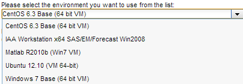
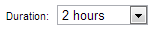
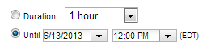

* Click New Reservation from the left navigation menu:

    

* Select the environment you would like to use from the drop-down box:

    

* Choose when you would like to use the environment. Select Now if you would like to use the environment immediately. Select Later and select a time in the future to schedule use of the environment.

    

* Select the duration you would like to use the environment. The maximum amount of time you can select for the duration varies by the access level of your account.

    

* If access has been granted to your account, you will see an Until option. This may be used to create long duration reservations.

    

* Click Create Reservation. The page displayed changes to the Current Reservations page. The status of the reservation will be Pending... until the remote computer has been prepared with the environment you selected. You can click on the Pending... link to view the progress:

    
