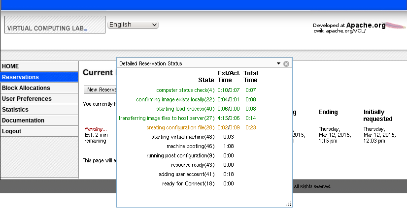

If using a version of VCL prior to 2.4, please see [Making a Reservation (previous to 2.4)](making-a-reservation-previous-2.4).

* Click **Reservations** from the left navigation menu:

    

* Click **New Reservation**

* Depending on your access, you may have 3 types of reservations to select from;
    * [Basic Reservation](basicreservation.html)
    * [Imaging Reservation](imagingreservation.html)
    * [Server Reservation](serverreservation.html)

        

* Select the environment you would like to use from the drop-down box:

    

* If you have the appropriate permissions and need to be able to disconnect from your reservation without the reservation timing out, you can check the box for **Disable timeout for disconnected users** (this permission is granted by adding users to the [Allow No User Check](special+user+groups.html) user group)

    

* Choose when you would like to use the environment. Select **Now** if you would like to use the environment immediately. Select **Later** to select a time in the future to schedule the use of the environment.

    

* Select the duration you would like to use the environment. The maximum amount of time you can select for the duration varies by the access level of your account.

    

* If access has been granted to your account, you will see an **At this time option**. This may be used to create long duration reservations. Server reservations also allow the option of selecting an indefinite end time.

    

* Click **Create Reservation**. The page is updated to include your new reservation. The status of the reservation will be Pending... until the remote computer has been prepared with the environment you selected. You can click on the ***Pending...*** link to view the progress:

    

* Once the node is deployed, a **Connect** button will appear:

    

* Click the **Connect** button to display information on how to connect to the reservation:

    
