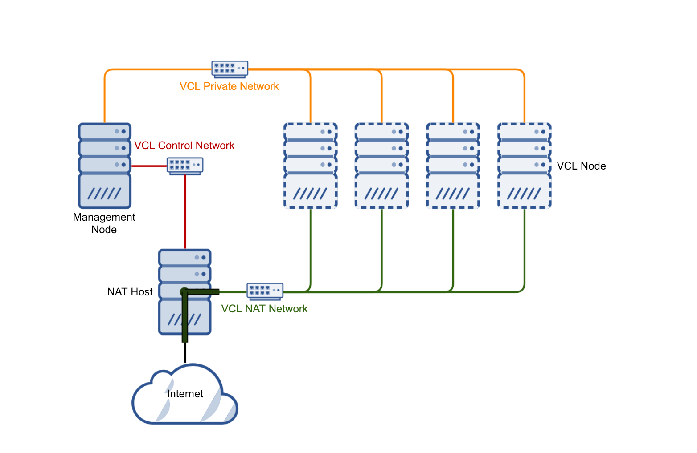

VCL handles most of the configuration of a NAT host the first time a reservation is deployed that uses the NAT host. However, there are some things that should be configured on the NAT host at installation time.

### Network Interfaces

Each NAT host should have at least 3 network interfaces:

1. **Private or control network**:

This interface should be configured with an IP address on the same network as the management node that will be deploying nodes using the NAT host. SSH must be configured to be listening on this interface as well as having identity keys set up so that root can ssh from the management node to the NAT host.

2. **NAT network**:

This interface should be configured with an IP address on the same network as the "Public" interface for each of the VCL nodes that will be deployed. This network carries user network traffic that flows between the NAT host and each VCL node. The NAT host needs to be configured to allow IP forwarding between this interface and the Public network interface.

3. **Internet/Public network**:

This interface should be configured with an IP address accessible on the public Internet, or whatever network users will be connected to for accessing the VCL system.

### Firewall Configuration

The firewall on the NAT host needs to be configured to

* Allow ssh from the management node
* Allow forwarding from NAT network to Public network
* Allow forwarding from Public network to NAT network
* Drop all other forwarding
* Drop incoming traffic from Public network (forwarded traffic does not get dropped along with this)
* Allow any additional traffic in needed to manage it in your environment

### iptables

If using iptables for the firewall, rules similar to the following should be configured.

- eth0 will be used for the Control network
- eth1 will be used for the NAT network with IP range 192.168.200.0/24 used on that network
- eth2 will be used for the Public network

        -A INPUT -s 192.168.100.10/32 -i eth0 -p tcp -m tcp --dport 22 -m state --state NEW -j ACCEPT # allow management node
        -A INPUT -m state --state RELATED,ESTABLISHED -j ACCEPT
        -A INPUT -p icmp -j ACCEPT
        -A INPUT -i lo -j ACCEPT
        -A INPUT -j REJECT --reject-with icmp-host-prohibited
        -A FORWARD -s 192.168.200.0/24 -i eth1 -o eth2 -j ACCEPT # allow traffic from NAT to Public
        -A FORWARD -d 192.168.200.0/24 -i eth2 -o eth1 -j ACCEPT # allow traffic from Public to NAT
        -A FORWARD -j REJECT --reject-with icmp-port-unreachable # reject any other forwarding
