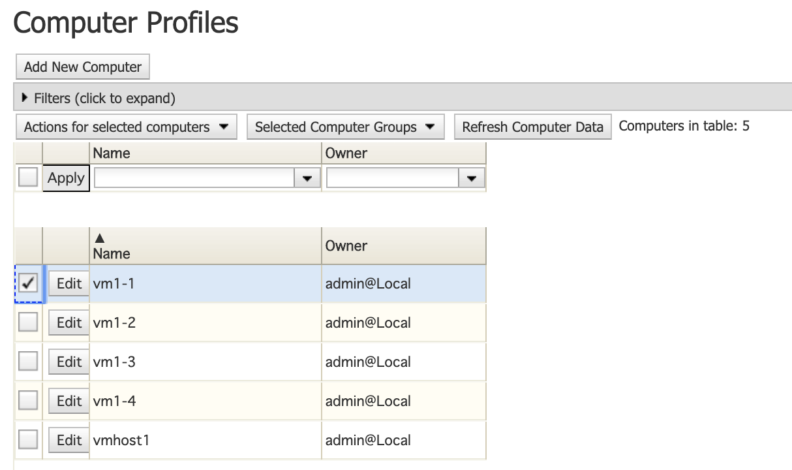

## Overview
In VCL, computers are in a constant state of one of two states: _available, and maintenance._

Computers in the **maintenance** state are in preservation and may be in the process of repair or is being updated on the latest software.

# Putting Computers in the Maintenance State

1. Click **Manage** and then navigate to **Manage Computers** and click it.     
   
   
2. Select _Edit Computer Profiles_ and click **Submit.** 
   
   
3. Select the **check-box** of the computer interested in.

    
4. Navigate to the _Actions for selected computers_ drop-down menu and select **Change State** -> select **Maintenance** and click **Confirm State Change.**

    