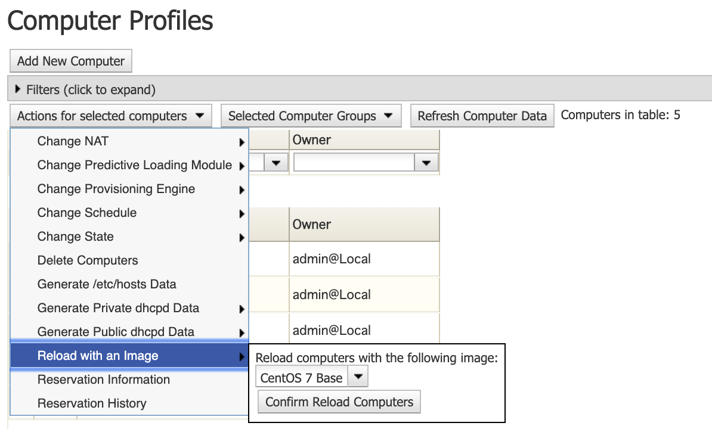

## Overview

On the VCL website, existing computers are pre-loaded with images. With administrative privileges, administrators have the ability to reload computers with a specific image.

**Refer to [Adding Images to Image Groups](https://cwiki.apache.org/confluence/display/VCLDOCS/Adding+Images+to+Image+Groups) for more information on images.**

# Reloading a Computer With a Specific image

1. Click **Manage** and then navigate to **Manage Computers** and click it.     
   
   
2. Select _Edit Computer Profiles_ and click **Submit.** 
   
   
3. Select the **check-box** of the computer interested in.

    
4. Navigate to the _Actions for selected computers_ drop-down menu and select **Reload with an Image** -> and select a specific image from the dropdown menu and click **Confirm Reload Computers**

    