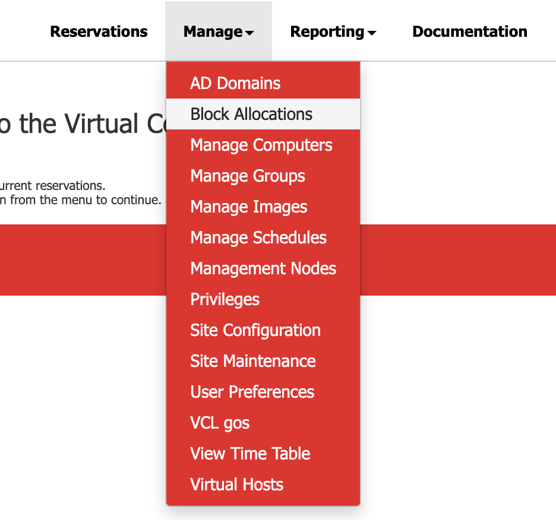
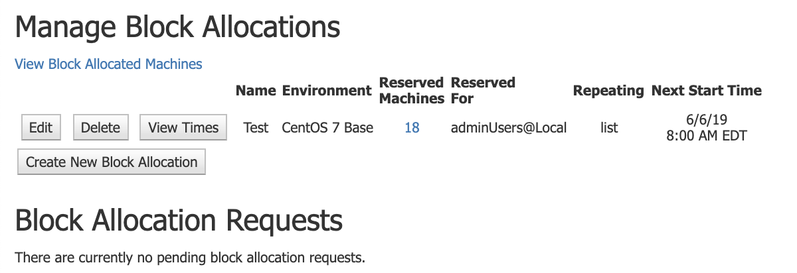
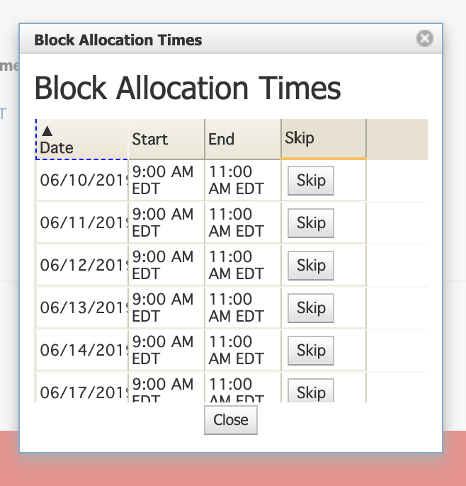

In order to skip an exisiting block allocation, follow these steps:

* Navigate to **Manage->Block Allocations**

    
* Click on **View Times** next to the preferred exisiting block allocation

    
*  Click **Skip** on the existing block allocation time period

     