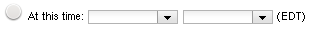

VCL has a few User Groups that have special meaning:

* Specify End Time
* Allow No User Check
* Default for Editable by

The **Specify End Time** user group allows users to see the At this time ending option for basic and imaging reservations, which allows a user to specify the exact end time of a reservation instead of just specifying a duration. This allows a user to make a reservation for much longer than is allows by selecting a duration.

The **Allow No User Check** user group allows users to see the **Disable timeout for disconnected users** checkbox when making a basic reservation. This prevents the reservation from being timed out due to the user being disconnected for too long. The time after which a reservation is timed out due to a user being disconnected is set under the **Re-connect To Reservation** Timeout value on the Site Configuration page. The default value for this is 15 minutes. Reservations longer than what is set under the **Connected User Check Threshold** value on the Site Configuration page are never timed out due to a user being disconnected. The default value for this is 24 hours. Imaging and server reservations are never timed out due to a user being disconnected.

The **Default for Editable** by user group is a little more unusual. When creating user groups, a user group must be specified that is allowed to edit the membership of the group being created. If a user does not know what group to select, there did not used to be a group that seemed to be an obvious choice. This resulted in users selecting random groups, granting anyone in those groups access to edit the membership of the group being created. The *Default for Editable* by group was introduced to help solve this problem. This group is the default group selected. If the user changes it and submits another group as the Editable by group, that other group is then saved in a cookie to be used as the default group the next time.
