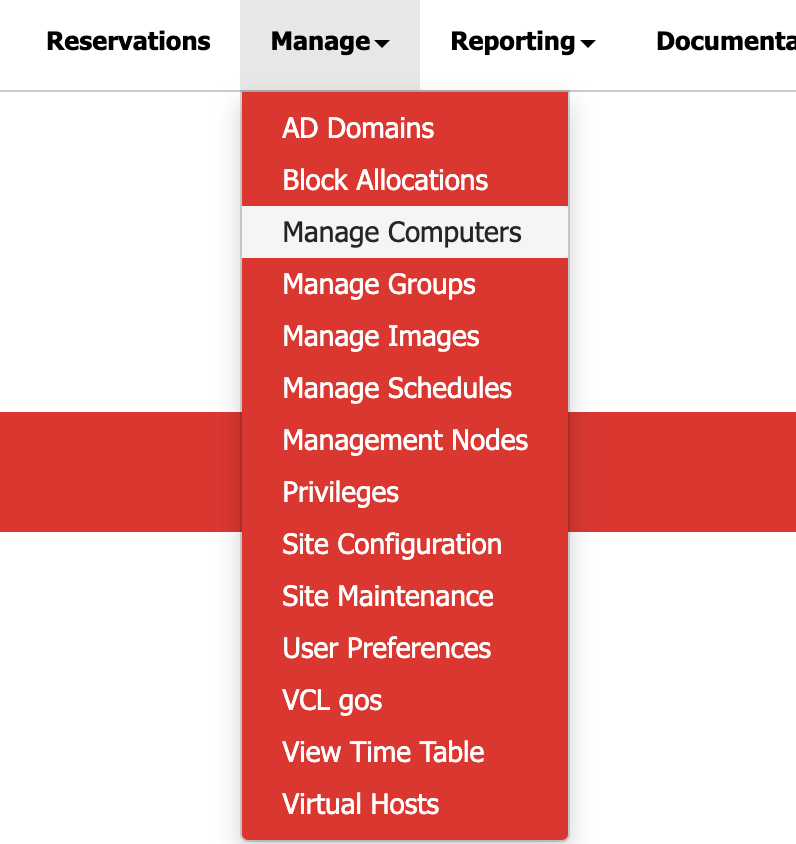
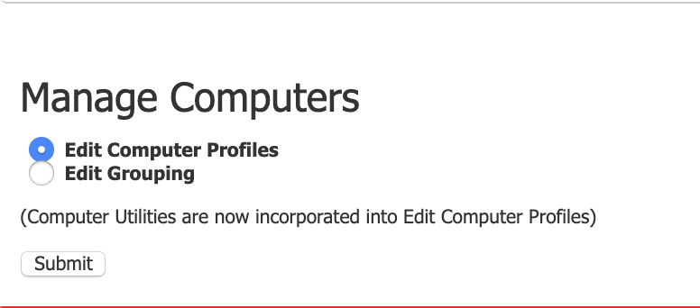
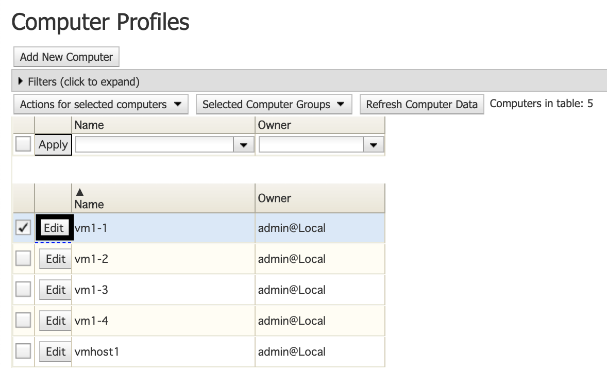
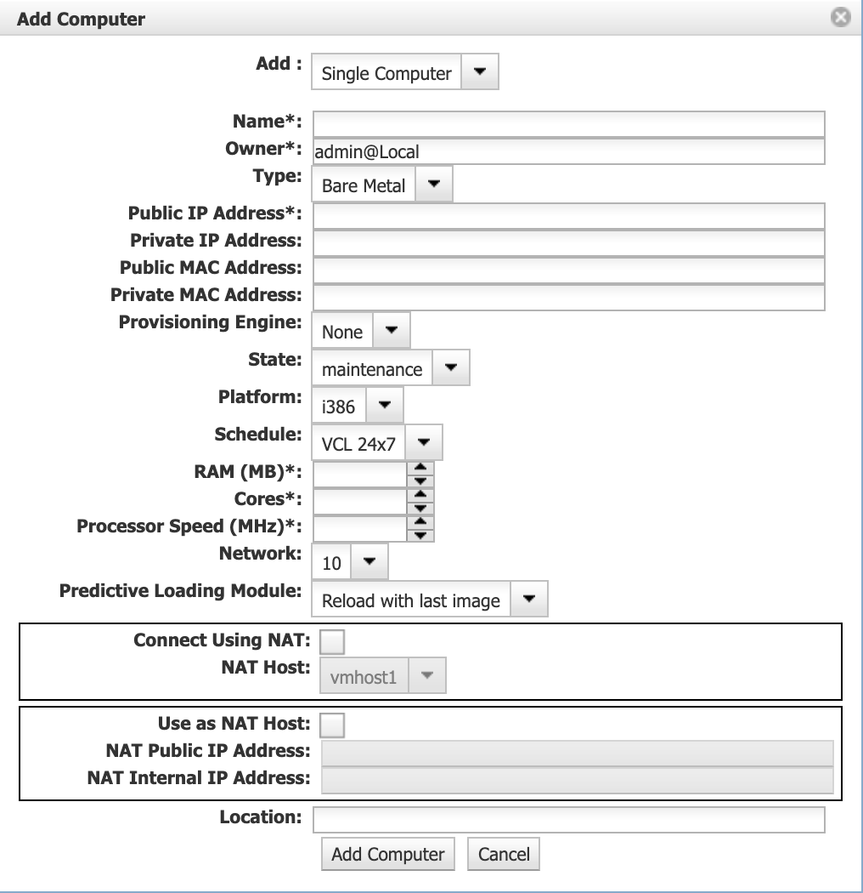

## Overview

On the VCL website, computers act as virtual machine hosts that users are able to connect to and create reservations for images that pertain to their interest.

With administration permissions, administrators are capable of viewing and modifying the properties of the existing computers within VCL.

This guide will highlight the steps on how to view computer information.

# Viewing Computer Information

1. Click **Manage** and then navigate to **Manage Computers** and click it.     
   
   
2. Select _Edit Computer Profiles_ and click **Submit.** 
   
   
3. Select _Edit_ next to the computer information interested in

    
4. On the next menu, the following information for the computer will be displayed:

   * _Single/Multiple_ computer(s)
   * **Name** of computer
   * Owner
   * **Type** of computer
   * Public & Private IP Address
   * Public & Private MAC Address
   * Provisioning Engine
   * State
   * Platform
   * Schedule
   * RAM (MB)
   * Core(s) 
   * Processor Speed (MHz)
   * Network
   * Predictive Loading Module

    

    **Refer to [Computer Predictive Loading Modules and Power Off](https://cwiki.apache.org/confluence/display/VCL/Computer+Predictive+Loading+Modules+and+Power+Off) for more information on predictive loading modules.**