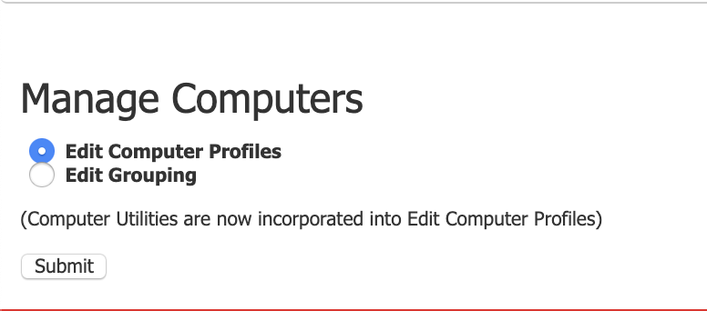

## Overview 

With administrative privileges, administrators have the ability to view certain computer's active reservation history. 

# Viewing Computer Active Reservation History

1. Click **Manage** and then navigate to **Manage Computers** and click it.     
   
   
2. Select _Edit Computer Profiles_ and click **Submit.** 
   
   
3. Select the **check-box** of the computer interested in.

    
4. Navigate to the _Actions for selected computers_ drop-down menu and select **Reservation History.**

    
5. Once selected, the reservation history for the selected computer will be displayed.

    