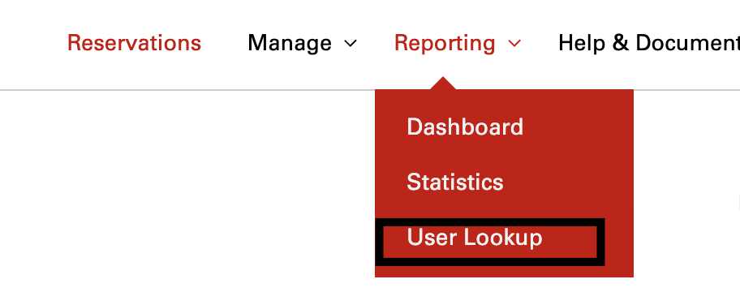
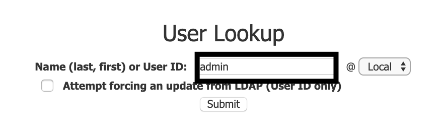

## Overview

Through the VCL website, uses can look up each other to view information regarding other user's ID, affiliation, email, permissions, login history, images that the user owns or has access to, and user's recent reservations.

This guide will discuss how to navigate the VCL website and view user information.

# Viewing User information

1. Navigate to the **Reporting** menu and select the *User Lookup* option
  
2. Type into the textbox the user-ID or name(last,first) with the appropriate affiliation and hit submit.
  
3. A list of the given user's information will then appear

   

  **NOTE**

  * If the affiliation is not specified, then the default affiliation will be
  associated with one respective to the current user.
  * If the user-ID is unknown and the information is searched with the Last name, First name- **this will only work if the user has logged into VCL prior.**
  * Checking the *Attempt forcing an update from LDAP (User ID only)* button is another way for users to search up other users. 
