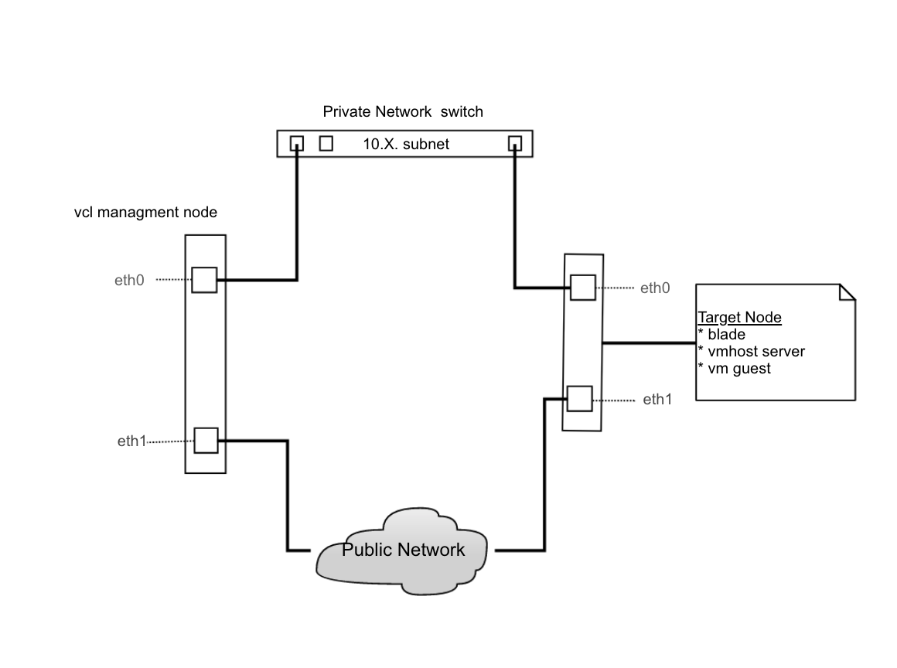
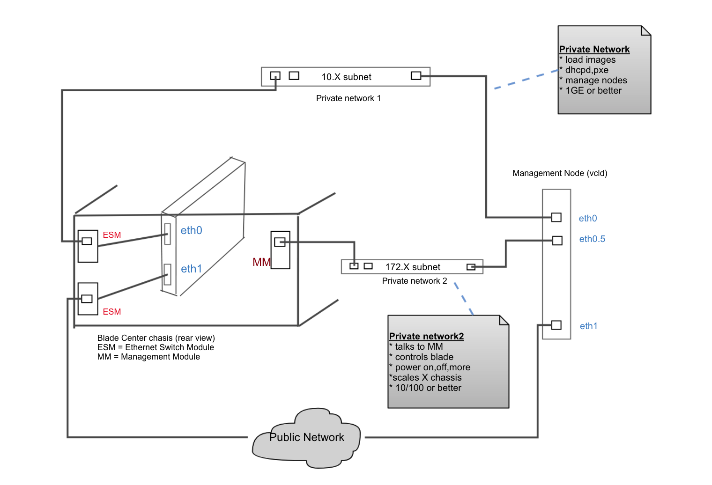

This page describes the basic network layout required in order for VCL to function. It also describes the recommended network layout if a blade chassis management module is used.

### At the simplest form VCL uses two networks

1. Private - applies to provisioning modules where node is reloaded, esx, vmware, etc.
    * Loading and boot strapping images
    * Managing reservations, adding/deleting accounts, controlling the OS on the node
    * Opens access ports on node for user requests on public network interface
    * Image Creation
    * DHCP serves fixed-addresses over this network to the eth0 adapter of the node
    * DHCP is run on the management node - prerequisite
2. Public
    * User accessible
    * VCL can either use dhcp(preferred) or statically assign addresses to the node on the public network

The diagram below shows the simple layout:

### Blade Center Network Layout

The network using blade center is more involved by adding a 2nd private network.

1. Private 1 - applies to provisioning modules, xCAT, vmware, etc.
2. Private 2
    * Allows management node to interact with blade center management module
    * provides scaling method for adding multiple blade center's
3. Public - user access

The diagram below shows the suggested network layout when using blade center.

